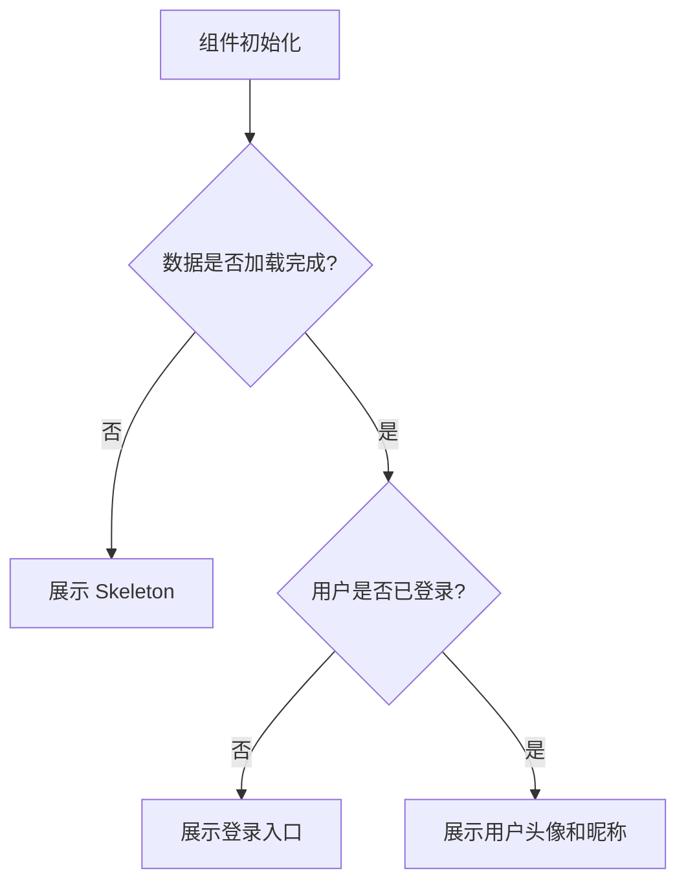

### 1. 渲染条件错误

我们项目是Next.js + CDN的架构设计，尤其是导航条里面用户信息的展示。



这里就是有水合问题的，水合问题说的是，React在客户端第一次渲染后的结果跟SSR出来的结果不一致。而带来这个问题的原因不是这种方案不行，而是我们的实现方式不对，我们的实现代码类似下面的：

```javascript
const isSSR = typeof window === 'undefined'

// 如果有认证信息，在用户信息确定之前（query 还未完成），应该一直显示骨架屏
// clientUser === undefined 表示 query 还没有结果（可能是 enabled 为 false，或者还在加载）
// 只有当 query 完成（isFetched 为 true）后，才显示真实内容
// 如果没有认证信息，直接显示未登录态
const shouldShowSkeleton = isSSR || (hasAuth && (!isFetched || isUserLoading || !user))
```

这里的问题就在于，服务端渲染的时候，`isSSR`是true，所以`shouldShowSkeleton`是true。然后客户端渲染的时候，如果未登录那hasAuth就是false，然后`shouldShowSkeleton`也是false。那这就是水合问题。如何解决呢？用下面的代码就好了：

```javascript
const [hasMounted, setHasMounted] = useState(false)

useEffect(() => {
  setHasMounted(true)
}, [])

// hydration 完成前始终显示骨架屏，与 CDN/SSR 缓存的 HTML 保持一致
// mount 后再根据 cookie / user 状态切换为真实 UI
const shouldShowSkeleton = !hasMounted || (hasAuth && (!isFetched || isUserLoading || !user))
```

### 2. 嵌套`p`标签

我们有下面的代码：

```javascript
<div
  ref={contentRef}
  className="md:pl-21 font-inter pl-[42px] text-xs font-normal leading-[1.6] text-white/60 md:text-xl"
  dangerouslySetInnerHTML={{
    __html: question.answer || '',
  }}
/>
```

而这个`question.answer`是来自动态运行时的i18n服务，那里面确实是有的用了`<p>`。当远程 answer 里含有`<p>`，再套在外层`<p>`上：

```html
<!-- React 想渲染的结构 -->
<p class="text-xs...">
  <p class="mb-4">1. Shop on the Store page...</p>
  <p class="mb-4">2. Recharge your balance...</p>
  ...
</p>
```

HTML 规范不允许 `<p>` 嵌套 `<p>`，浏览器解析时会自动「拆」。React hydration 时期望的是第一种结构，实际 DOM 是第二种，于是就报错了。报错里的：

- \_\_html: "" → 外层 `<p>`被掏空
- 多个 `<p class="mb-4">` → 内层段落被提升成兄弟节点

```html
<!-- 浏览器实际 DOM -->
<p class="text-xs..."></p>
<!-- 外层变空 -->
<p class="mb-4">1. Shop...</p>
<!-- 被提升为兄弟节点 -->
<p class="mb-4">2. Recharge...</p>
```
